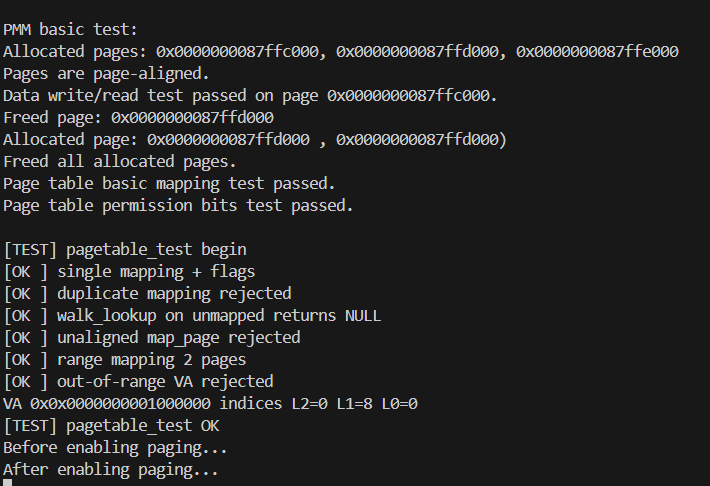
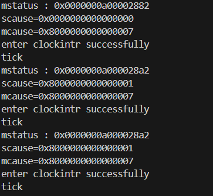

## 实验三 ：页表与内存管理

### 系统设计部分

#### 架构 设计说明

​	在 xv6 的页表设计中，虚拟地址位 39 位，并且分为四个部分，使用三节页表来进行管理，其中每一级页表都是占 9 位，最低的 offset 占 12 位，在 xv6 中一页的大小为 4 kb 也就是$2^{12}$ ，所以页内偏移是 12 位，在xv6 中一个页表项大小为 8 字节，所以一个页面可以存放的页表项数目为 $(4 \times 2 ^{10}) \div 64 = 512 = 2 ^{9}$  ，所以每一个级页表使用 9 位可以刚好使用一个物理页来存储页表项

​	在xv6 中，物理页面分配使用的是空闲分区链的形式，按照物理页为单位，用一个链表来串起来，每一个空闲页面的起始位置 存储的是指向下一个空闲页的指针，每次分配或者回收页面的时候就会操作dump 哑结点的头指针

​	这样的缺点是每次只能回收和分配一个物理页，效率低，而且容易产生内存碎片，我采用的改进方法是使用 buddy 伙伴算方法，具体来说就是对物理内存按照二的幂进行分块，然后每次使用的时候分配最小能容纳当前需要大小的块

#### 关键数据结构

```c

// 空闲块链表节点
struct free_block
{
    struct free_block *next;
    struct free_block *prev;
}; 

// 伙伴系统管理结构
struct buddy_system // 这个结构体存储在.bss 段中，永远都不会被释放
{
    struct free_block free_lists[MAX_ORDER + 1]; // 每个order的空闲链表
    // unsigned long *bitmap;                       // 位图，标记块的分配状态 有 pages 就不需要 bitmap 了
    unsigned long total_pages; // 总页数
    unsigned long free_pages;  // 空闲页数
    void *memory_start;        // 内存起始地址
    struct spinlock lock;      // 保护整个伙伴系统
};

// 页面元数据
struct page_info // 页面信息结构体声明 这里没有实例化，后面使用的是指针
{
    unsigned int order; // 该页面所属块的大小（2^order页）
    unsigned int flags; // 页面标志
#define PAGE_FREE 0x01  // 页面空闲
#define PAGE_HEAD 0x02  // 块的首页面
    // #define PAGE_BUDDY 0x04 // 是否可以与伙伴页面合并
};

```

#### 与 xv6 对比分析

​	与xv6仅能管理单个、不连续物理页的简单链式分配器不同，伙伴系统的核心优势体现在其高效处理**连续物理内存**的能力上。它通过按需分裂大内存块来满足不同大小的连续内存请求，这对于驱动程序和DMA等硬件操作至关重要。更关键的是，当内存被释放时，伙伴系统会主动尝试将相邻的空闲“伙伴”块**合并**成一个更大的块。这种独特的合并机制能够持续地对抗外部内存碎片，确保系统在长时间运行后依然有能力提供大块的连续内存，从而在内存利用率和系统稳定性上远超xv6的教学设计。

### 实验过程部分

#### 实验步骤记录

​	在 ld 文件分配好各个内核区的大小和地址之后，在 end 之后进行堆内存分配，通过 `(void *) PGROUNDUP((uint64) end)` 来对内核结束地址进行向上对齐（地址从内核到堆向上增长) ，来保证分配的地址不会破坏内核中的数据，然后分配 pageinfo 数组记录下pages 数组 之后的可分配内存的物理页大小，注意这里的total_pages 实际上会大于实际的物理页面数量

​	`alloc_pages(int order)` 函数中分配内存的是时候, 分配的是满足$2^{order}$ 大小的最小块，具体逻辑为首先遍历 free_lists 数组 (每个order也就是索引对应block 的地址) ，找到空闲块，此时如果发现空闲的块过大，那么就需要对块进行分割，然后将后半块加入对应 order 的空闲链

​	`free_pages(void * page,int order)` 释放物理页面的函数，在释放一个块的时候尝试 和伙伴块合并，具体算法是 

 ```c
 uint64 pfn = ((uint64)page - (uint64)buddy.memory_start) / PGSIZE; //计算出页面偏移数量
 uint64 buddy_pfn = pfn ^ (1UL << order); //计算伙伴块的页面偏移量
 return (void *) ((uint64)buddy.memory_start + buddy_pfn * PGSIZE); // 转换为伙伴地址
 ```

​	得到对应 buddy 块的首地址之后判断是否空闲，如果空闲就进行合并，删除两个小块，得到一个大块加入对应数组的空闲链表

#### 问题与解决方案

| 问题                                     | 根因                            | 解决                           |
| ---------------------------------------- | ------------------------------- | ------------------------------ |
| 重复定义 `freewalk` 链接失败             | 头文件暴露 + 源文件 static 冲突 | 移除头文件声明，内部 static    |
| `walk_lookup` 返回未映射槽位导致断言失败 | 语义不明确                      | 增加有效位检查，未映射返回 0   |
| 未对齐测试触发 panic                     | 实现硬退出                      | 改返回 -1，测试断言返回值      |
| 多页映射连续性假设可能失效               | buddy 不保证连续                | （计划）改成逐页映射独立物理页 |
| `%lx` 打印异常                           | printf 未实现长度修饰           | 改用 `%p` 或扩展解析器         |
| 函数名拼写 `destory_pagetable`           | 打字错误                        | 添加正确别名并计划统一         |

#### 源码理解总结

- 分配/释放核心在“阶平衡”：分裂保证向下递归建立链，合并利用伙伴地址 XOR 特性。
- 页表建立的关键在逐级索引：`PX(2/1/0, va)`；`walk` 在中间层缺失时按需分配（只 Zero 清理保证安全）。
- 安全点：所有映射接口对齐检查 + 越界检查（`va >= 1<<39` 直接拒绝）。
- 释放策略阶段性保守：不释放叶子物理页给后续“用户地址空间”留出明确控制点。

### 测试验证部分

#### 功能测试结果

使用多个测试函数涵盖了多重使用场景，包括异常数据测试以及 多次分配测试

```

void pagetable_test(void)
{
    pagetable_t pt = create_pagetable();

    // 测试基本映射
    uint64 va = 0x1000000;
    uint64 pa = (uint64)alloc_page();
    assert(map_page(pt, va, pa, PTE_R | PTE_W) == 0);

    // 测试地址转换
    pte_t *pte = walk_lookup(pt, va);
    assert(pte != 0 && (*pte & PTE_V));
    assert(PTE2PA(*pte) == pa);
    printf("Page table basic mapping test passed.\n");

    // 测试权限位
    assert(*pte & PTE_R);
    assert(*pte & PTE_W);
    assert(!(*pte & PTE_X));
    printf("Page table permission bits test passed.\n");
}

void virtual_memory_test()
{
    printf("Before enabling paging...\n");
    kvminit();
    kvminithart();
    printf("After enabling paging...\n");
}

void pagetable_test_enhanced(void)
{
    printf("\n[TEST] pagetable_test begin\n");
    pagetable_t pt = create_pagetable();
    assert(pt != 0);

    // 1. 根页表清零性（抽样检查几个槽位）
    for (int i = 0; i < 8; i++)
        assert(((uint64 *)pt)[i] == 0);

    // 2. 基本单页映射
    uint64 va = 0x01000000; // 16MB 对齐
    uint64 pa = (uint64)alloc_page();
    assert((va & (PGSIZE - 1)) == 0 && (pa & (PGSIZE - 1)) == 0);
    assert(map_page(pt, va, pa, PTE_R | PTE_W) == 0);

    pte_t *pte = walk_lookup(pt, va);
    assert(pte && (*pte & PTE_V));
    assert(PTE2PA(*pte) == pa);
    assert((*pte & PTE_R) && (*pte & PTE_W) && !(*pte & PTE_X));
    printf("[OK ] single mapping + flags\n");

    // 3. 重复映射应失败
    assert(map_page(pt, va, pa, PTE_R | PTE_W) != 0);
    printf("[OK ] duplicate mapping rejected\n");

    // 4. 未映射地址查询
    uint64 va2 = va + 0x2000; // 没有建立映射
    assert(walk_lookup(pt, va2) == 0);
    printf("[OK ] walk_lookup on unmapped returns NULL\n");

    // 5. 非法参数测试（未对齐）
    uint64 bad_va = va + 123;
    assert(map_page(pt, bad_va, pa, PTE_R) == -1);
    printf("[OK ] unaligned map_page rejected\n");

    // 6. 多页区间映射（mappages）
    uint64 va_range = 0x02000000;
    void *pA = alloc_page();
    void *pB = alloc_page();
    assert(pA && pB);
    assert(mappages(pt, va_range, 2 * PGSIZE, (uint64)pA, PTE_R | PTE_W) == 0);
    // 第二页物理应是 pA + PGSIZE（因为我们假设连续页；若 buddy 不保证，改成逐页 map_page）
    pte_t *pteA = walk_lookup(pt, va_range);
    pte_t *pteB = walk_lookup(pt, va_range + PGSIZE);
    assert(pteA && pteB);
    assert(PTE2PA(*pteA) == (uint64)pA);
    assert(PTE2PA(*pteB) == ((uint64)pA + PGSIZE)); // 若失败，说明物理不连续
    printf("[OK ] range mapping 2 pages\n");

    // 7. 中间页表未被多余创建：尝试查询一个远地址，walk_lookup 不应分配
    uint64 far_va = 0x4000000000ULL; // 超出 Sv39 (1<<39) → 直接 0
    assert(walk_lookup(pt, far_va) == 0);
    printf("[OK ] out-of-range VA rejected\n");

    // 可选：打印三级索引
    int l2 = PX(2, va), l1 = PX(1, va), l0 = PX(0, va);
    printf("VA 0x%p indices L2=%d L1=%d L0=%d\n", (void *)va, l2, l1, l0);

    // 释放（注意：destroy_pagetable 只应释放页表页，不释放 pA/pB/pa 指代的数据页）
    destory_pagetable(pt);
    free_page((void *)pa);
    free_page(pA);
    free_page(pB);

    printf("[TEST] pagetable_test OK\n");
}

```




所有测试均可通过

## 实验四：中断处理与时钟管理

### 系统设计部分

#### 架构设计说明

本次实验旨在实现一个基于 RISC-V 特权级架构的、健壮的时钟中断处理机制。核心架构采用 **“M 模式代理，S 模式执行”** 的模型。

1.  **硬件中断捕获 (M-Mode)**: CPU 的物理定时器（CLINT）触发的中断属于机器模式（M-Mode）。该中断由 M 模式专属的陷阱处理程序 `timervec` 捕获。
2.  **中断代理与重置 (M-Mode)**: M 模式处理程序 `machine_timer_handler` 的职责有二：
    *   **重置闹钟**: 立即调用 `timer_set_next()`，设置下一次硬件中断的时间，避免中断风暴。
    *   **发送信号**: 通过向 `sip` (Supervisor Interrupt Pending) 寄存器写入 `SSIP` 位，向监管者模式（S-Mode）发送一个“软件中断”信号。
3.  **操作系统逻辑处理 (S-Mode)**: S 模式的通用陷阱处理程序 `kernelvec` 在 `mret` 返回后，会立即捕获到待处理的软件中断。
4.  **任务执行与清理 (S-Mode)**: `trap()` 函数根据 `scause` 识别出是软件中断，并调用 S 模式的 `clockintr()` 函数。`clockintr()` 负责执行操作系统层面的任务（如更新 `ticks` 计数器），并在最后**必须**清除 `sip` 寄存器中的 `SSIP` 挂起位，表示“任务已处理完毕”。

这种架构将硬件相关的底层操作（与 CLINT 交互）严格限制在 M 模式，而将操作系统相关的逻辑（进程调度、时间管理）放在 S 模式，实现了清晰的职责分离。

#### 关键数据结构

-   `volatile uint64 ticks`: 全局时钟滴答计数器，由 S 模式的 `clockintr` 维护。
-   `struct spinlock tickslock`: 用于保护 `ticks` 变量在多核环境下的原子性访问。

### 与 xv6 对比分析

-   **中断模型**: xv6 利用 `sstc` 扩展，将定时器中断**完全委托**给 S 模式处理，M 模式完全不参与。本实验采用的**M 模式代理模型**则更具通用性，不依赖 `sstc` 扩展，M 模式扮演了硬件抽象层的角色。
-   **复杂性**: M 模式代理模型需要处理 M/S 两级之间的通信（通过 `sip` 寄存器）和上下文切换，逻辑链条更长，但也更清晰地展示了 RISC-V 的特权级思想。
-   **启动流程**: xv6 在 S 模式的 `main` 函数中开启中断。本实验的最终方案是在 M 模式的 `start.c` 中，利用 `mstatus.MPIE` 位，让 `mret` 指令原子性地开启 M 模式中断，解决了启动过程中的时序问题。

### 设计决策理由

选择 M 模式代理模型，主要基于以下考虑：

1.  **学习价值**: 完整地经历了 M/S 两级中断的设置、委托、代理和处理全过程，能更深刻地理解 RISC-V 特权级架构。
2.  **硬件兼容性**: 该模型不依赖 `sstc` 扩展，在更广泛的 RISC-V 硬件平台上具有更好的兼容性。
3.  **安全性与隔离性**: 将直接操作物理硬件（如 CLINT）的代码严格限制在 M 模式，符合最小权限原则，使 S 模式的内核代码更加安全。

---

### 实验过程部分

#### 实现步骤记录

1.  **M 模式入口**: 在 `start.c` 中设置 `mtvec` 指向 `timervec`，并设置 `mstatus.MPIE` 以便在 `mret` 后安全开启 M 模式中断。
2.  **S 模式入口**: 在 `start.c` 中设置 `stvec` 指向 `kernelvec`。
3.  **中断委托**: 在 `start.c` 中，通过 `mideleg` 寄存器委托除机器定时器中断（`MTI`）外的所有中断给 S 模式。
4.  **首次中断设置**: 在 `start.c` 的 `mret` 之前，调用 `timer_init_once()` 设置一个较长的首次中断间隔，以解决启动竞态问题。
5.  **M 模式处理程序**: 实现 `machine_handler.c`，在其中调用 `timer_set_next()` 重置下一次硬件中断，并通过 `w_sip()` 向 S 模式发送软件中断。
6.  **S 模式处理程序**: 实现 `trap.c` 中的 `trap()` 和 `clockintr()`。`trap()` 负责分发中断，`clockintr()` 负责更新 `ticks` 计数并清除 `sip` 中的 `SSIP` 挂起位。

#### 问题与解决方案

| 问题                        | 根因分析                                                     | 解决方案                                                     |
| :-------------------------- | ------------------------------------------------------------ | :----------------------------------------------------------- |
| **无任何中断**              | 启动时序竞态：S 模式的 `intr_on` 还未执行，M 模式的首次中断就已到来并被忽略。 | 在 `start.c` 中设置一个**超长**的首次中断间隔 (`timer_init_once`)，给 `main` 函数的初始化留出充足时间。 |
|                             |                                                              |                                                              |
| **中断风暴**                | M 模式处理程序 `machine_timer_handler` 未重置下一次硬件中断时间 (`mtimecmp`)，导致 `mtime >= mtimecmp` 条件持续满足。 | 在 `machine_timer_handler` 中，第一件事就是调用 `timer_set_next()` 来安排下一次硬件中断。 |
| **S 模式中断死循环**        | S 模式的 `clockintr` 在处理完中断后，未清除 `sip` 寄存器中的 `SSIP` 挂起位，导致 `sret` 返回后立即再次陷入同一个中断。 | 在 `clockintr` 函数的末尾，调用 `w_sip(r_sip() & ~(1 << 1))` 来“销假”，清除软件中断挂起位。 |
| **非法指令 (`scause=2`)**   | `trap` 函数在 S 模式下运行但是使用了M 模式的寄存器导致发生了异常 | 不在 S 模式下直接读取 M 模式寄存器，改为在 `main` 函数早期判断 `hartid` 并让非主核心休眠。 |
| **kernelvec入口地址未对齐** | kernelvec 函数地址未对齐导致低两位不是0，无法正常写入 stvec ，导致kernel 无法跳转，这里卡了我好久 悲 | 在kernelvec.S 中添加 .align 4 来强制对齐低两位               |

#### 源码理解总结

本次实验深刻揭示了 RISC-V 特权级架构的精髓。`mstatus`, `sstatus`, `mie`, `sie`, `sip`, `mtvec`, `stvec` 等一系列 CSR 共同构成了一个精密的、分层的中断控制系统。任何一个环节的配置错误（如 `FS` 位未开、`MPIE` 与 `MIE` 的混淆、`sip` 未清除），都会导致系统以一种看似“灵异”的方式崩溃。通过本次调试，我们理解到编写操作系统不仅是实现功能，更是对硬件规范的精确理解和对执行时序的严格控制。

---

### 测试验证部分

### 功能测试结果

通过在 `main.c` 和 `trap.c` 中添加一系列 `printf` 调试语句，最终实现了预期的功能：

1.  系统正常启动，`main` 函数打印初始化信息。
2.  在首次长延时后，M 模式中断处理程序被触发，并打印 `mstatus` 等信息。
3.  S 模式中断处理程序 `clockintr` 被成功调用，并稳定地、按 `TIMER_INTERVAL` 定义的间隔（约 0.1 秒）周期性打印 "tick" 信息。
4.  `ticks` 计数器能够正常累加，证明中断处理逻辑正确。

### 实验过程部分

#### 问题与解决方案

​	在一切都正常的情况下，出现没有时钟中断输出的情况，经过仔细排查我发现是M 模式 和 S 模式的中断处理不正确导致的，首先我在 M 模式运行`start.c` 函数时，直接开启了M模式中断的使能信号 `MIE` 以及时钟中断接受信号 `MIE_MTIE` 并且开启了时钟中断，并且时钟中断触发非常频繁导致 M 模式的中断不停被触发，都没有机会跳转到 `main` 函数进行执行，所以会出现控制台没有输出的情况，

+ 解决方案： 延长中断触发的间隔，并且在`start.c` 文件中只设置`MPIE` 保证在执行 `mret` 指令切换到 S 模式的时候才会开启 M 模式的中断

​	注意这里有个大雷，`r_mhartid` 函数只能在 M 模式下执行，所以在 S 状态下执行会报错，这就是我之前每次都会在 trap 函数中产生异常的原因，`kerneltrap` 函数是在 S 模式下执行的，所以试图读取 M 模式下的寄存器就会触发这个异常，同时因为这个异常发生在`trap` 里面，就会导致遗产个无限递归

实验结果，每隔一段时间输出一个tick 来证明 时钟中断可以被正确触发




